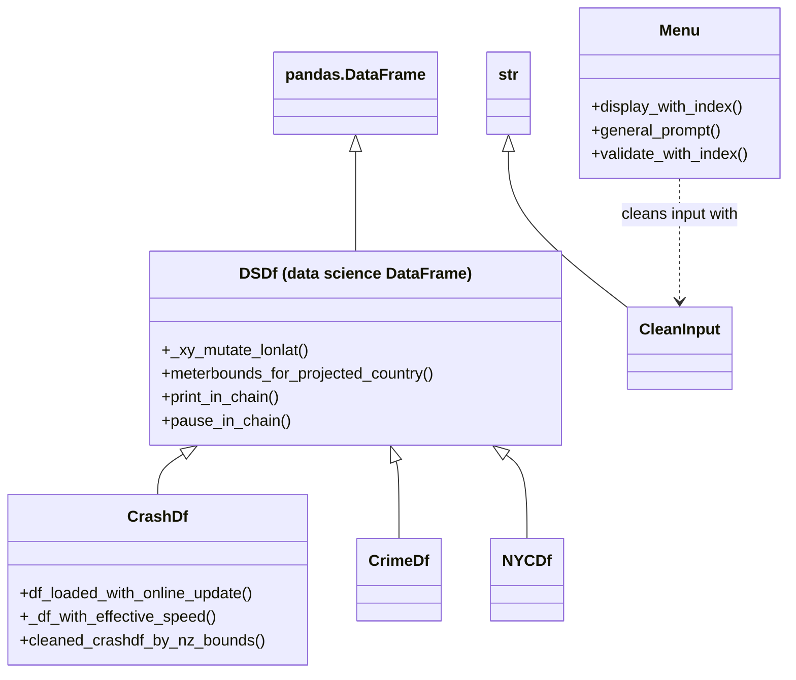

# NZ Road Crash Analysis Tool (Python, OOP)

An interactive Python tool for exploring **856,000+ New Zealand road crashes** from Waka Kotahi's Crash Analysis System: it keeps the data up to date through the live API, cleans it, and turns it into crash-severity reports, trend graphs and interactive maps.

Built for the University of Canterbury course *Computer Programming* (COSC480, grade A+). What started as a simple script grew into a small object-oriented framework, and building it changed how I think about code. That story is [below](#how-this-project-changed-the-way-i-code).

**▶ Explore the interactive maps:** [fatal crash heatmap (animated by year)](https://williamhuichang-code.github.io/nz-road-crash-analysis/data/fatal_heatmap_with_year.html) · [serious and fatal crash pinmap](https://williamhuichang-code.github.io/nz-road-crash-analysis/data/pinmap_bright_dark.html) · [severity cluster map](https://williamhuichang-code.github.io/nz-road-crash-analysis/data/cluster_map_for_severity.html)

<!-- screenshots: add images to screenshots/ and uncomment

-->

## What it does

Run the program and a menu guides you through:

| Feature | What you get |
|---|---|
| **Crash severity report** | Crash counts by severity for any year and speed limit: all values, a range (e.g. 2010–2015) or a single value, and any combination of severity types |
| **Crash trends graph** | The same selections plotted over time (matplotlib) |
| **Fatal crash heatmap** | An animated Folium heatmap showing how fatal crash hotspots change year by year |
| **Crash pinmap** | Serious and fatal crashes as pins with detailed pop-ups (year, location, weather, and whether trees or motorcycles were involved), side-by-side light and dark maps, and location search |
| **Crash cluster map** | All severities grouped into clusters with severity icons and layer toggles, readable even with thousands of points |

Behind the menu, the data goes through several automatic steps:

- **Live update:** checks the Waka Kotahi API for crashes newer than the local file and downloads them in chunks, respecting the server's record limit.
- **Effective speed limit:** uses the temporary speed limit where one applies, otherwise the normal limit.
- **Coordinates:** converts NZTM metres (EPSG:2193) to longitude/latitude (EPSG:4326) with pyproj, so the data works with web maps.
- **Cleaning:** removes crashes whose coordinates fall outside New Zealand's official bounds.
- **Input validation:** every prompt shows the valid options, standardises what you type, and explains what went wrong if it can't be matched (for example, a year with no records).

## How it's designed



- **`DSDf`** extends `pandas.DataFrame` with general data science steps, such as coordinate conversion and helpers that print or pause *inside* a method chain. It keeps its own type after slicing, so a filtered `DSDf` is still a `DSDf`.
- **`CrashDf`** adds everything specific to the crash data: loading with the live API update, the effective speed limit and cleaning by NZ bounds. `CrimeDf` and `NYCDf` are placeholders showing how the same base could serve other datasets.
- **`Menu`** and **`CleanInput`** handle all user interaction in one consistent way.
- **Feature functions** (`module_crashdf_features.py`) chain these methods into reports and maps, and **`main.py`** only runs the menu.

The result reads like a pipeline:

```python
# data: load → update from the API → effective speed → lon/lat → clean
df = CrashDf.df_loaded_with_online_update(CrashDf._crash_csv_name).cleaned_crashdf_by_nz_bounds()

# user input: show the options → ask → validate
choice = Menu(options).display_with_index().general_prompt().validate_with_index()
```

## How this project changed the way I code

My coding style went through three stages during this project, and each one changed how I think about writing code.

**1. Making it work (weeks 1–5).** At first my only goal was working code. I was still learning pandas and matplotlib, and functions grew long as I added features. Before long, I was getting lost in my own code.

**2. Making it readable (weeks 5–7).** I started breaking large functions into small ones, each doing one thing. The code became easier to read and test, and I began to see repeated patterns across features.

**3. "Pypelines": from functions to objects (week 8 onwards).** The real turning point came from R. In R, `%>%` lets data flow through a chain of steps: `df %>% mutate() %>% filter() %>% summarise()`. I wanted the same in Python, where the output of one step naturally becomes the input of the next. I called the idea "Pypelines", and chasing it led me to object-oriented programming.

- **Objects that operate on themselves.** If each method returns the object itself, a chain of methods becomes a pipeline. So I made the DataFrame the object: `DSDf` extends pandas, and a crash dataset can *enrich itself, clean itself and describe itself*. Every step reads in order, top to bottom.
- **The menu became an object too.** A menu displays itself, prompts for input, validates it and returns a clean answer, which is exactly `Menu(...).display_with_index().general_prompt().validate_with_index()`.
- **Framework over script.** Because general behaviour lives in `DSDf` and crash-specific behaviour in `CrashDf`, the structure can serve a different dataset just by adding a subclass. For the first time I was designing something reusable, not only solving this one assignment.

A few lessons I still use:

- **Standardise before you compare.** Good validation doesn't expect perfect input. It cleans both the user's input and the valid options into the same form, then compares them.
- **Build once, reuse everywhere.** The same selection functions (all values, a range or a single value) drive both the report and the trends graph, so a new filter only needs to be written once.
- **Think in columns, not loops.** With 856,000 rows, I replaced a row-by-row `.apply()` with the vectorised `combine_first()` for the speed-limit fallback.
- **Use the right reference instead of guessing.** I first thought of finding bad coordinates with boxplot outliers. Instead I used the official coordinate system definitions (pyproj), which reflect New Zealand's real boundaries.

This way of thinking carried into later projects. In [DSI Studio](https://github.com/williamhuichang-code/shiny-dsi-studio), my R Shiny app, I built the same idea at a larger scale: 45+ modules and a chained data pipeline where each stage passes its output to the next.

The detailed notes behind each feature, including how I implemented it and why I chose each approach, are in [docs/design-notes.md](docs/design-notes.md).

## Run it locally

1. Install Python 3.9+ and the packages: `pip install -r requirements.txt`
2. Download the full dataset (CSV) from [Waka Kotahi's Crash Analysis System](https://opendata-nzta.opendata.arcgis.com/datasets/8d684f1841fa4dbea6afaefc8a1ba0fc_0/explore) and save it as `data/Crash_Analysis_System_(CAS)_data.csv`. To keep it somewhere else, set the environment variable `CRASH_DATA_DIR` to that folder.
3. Run `python main.py` and follow the menu.

Each time it starts, the program downloads any crashes added since your copy, for that session only. Maps are saved to `data/` and open in your browser.

## Repository contents

```
main.py                      menu and program entry point
class_dsdf.py                DSDf: DataFrame base class for data science steps
subclass_crashdf.py          CrashDf: crash-specific loading, API update and cleaning
subclass_crimedf.py,         placeholders showing how other datasets
subclass_nycdf.py              would reuse the framework
class_helper_menu.py         Menu: display, prompt and validate
class_helper_clean_input.py  CleanInput: standardises user input
module_crashdf_features.py   reports, trends graph and maps
data/                        generated interactive maps (HTML)
docs/design-notes.md         feature-by-feature implementation notes
```

## Next steps

- Add unit tests (pytest) for the class methods and run them automatically with GitHub Actions.
- Complete `CrimeDf` and `NYCDf` to show the framework on other datasets.

## Credits

- Data: [Waka Kotahi NZ Transport Agency, Crash Analysis System (CAS)](https://opendata-nzta.opendata.arcgis.com/datasets/8d684f1841fa4dbea6afaefc8a1ba0fc_0/explore), CC BY 4.0.
- Maps: [Folium](https://python-visualization.github.io/folium) (Leaflet.js); coordinates: [pyproj](https://pyproj4.github.io/pyproj/stable/).
- Course: COSC480 Computer Programming, University of Canterbury.
